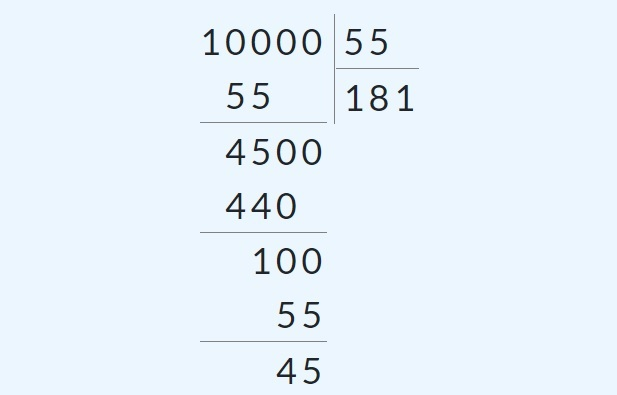

## Giải thích thuật toán

# Khởi tạo

Giả sử đang có phép tính U / V với U có (m + n) chữ số và V có n chữ số. B là cơ số (phép tính bình thường B = 10, máy tính thì thường là 2^32 hoặc 2^64)
Với U = (u_{m+n -1}, u_{m+n-2}, ..., u_1, u_0)_B và V = (v_{n-1}, v_{n-2}, ..., v_1, v_0)_B  

## Tại sao U lại có (m + n) chữ số?

Theo thuật toán, nếu U có m + n chữ số, V có n chữ số, thì thương Q có tối đa m + 1 chữ số

Ví dụ: U = 12345 (5 chữ số), V = 12 (2 chữ số) thì

m + n = 5
n = 2
<=> m = 5 - 2 = 3

Thương số Q có tối đa m + 1 = 3 + 1 = 4 chữ số

### Cách chọn cơ số Base 

Không theo tiêu chuẩn nào cả, nhưng trong máy tính thường được chọn dựa trên giới hạn phần cứng (kính thước thanh ghi CPU) để tối ưu tốc độ tính toán. Ví dụ trong hệ 32-bit (B = 2^32) hoặc 64-bit (B = 2^64).

Tại sao lại chọn như vậy?
- Tốc độ: Phép tính modulo $2^k$ hay nhân/chia với $2^k$ trở thành các phép dịch bit (cho chia lấy phần nguyên) và bitwise AND (cho modulo) cực kỳ nhanh ở cấp độ phần cứng. Không tốn cycle nào cho phép chia thực sự. Ví dụ: 
  - 12 / 8 => dịch k=3 bit => 1100 >> 3 => 0001 = 1
  - 12 % 8 => 1100 & 0111 => 0100 = 4
- Tận dụng thanh ghi: Vừa khít với thanh ghi 32-bit hoặc 64-bit của CPU hiện đại.

### Thuật Toán Knuth D

#### D1: Chuẩn hóa

**Công thức:** $d = \left\lfloor \frac{B}{v_{đầu} + 1} \right\rfloor \implies U = U \times d$ và $V = V \times d$

**Bản chất:** Là một phép nhân d cho U và V. Nó phóng to cả hai số lên cùng một mức nên kết quả phép chia hoàn toàn không bị thay đổi. Khi có phần dư $R$, ta chỉ cần chia $R$ với d

**Mục đích:** Việc ép chữ số đầu tiên của số chia ($U$) to ra sẽ giúp máy tính không bị "ảo giác" bởi các chữ số phía sau khi nó nhẩm đoán kết quả ở D3.

#### D2: Khởi tạo 

**Công thức:** $j = m = \text{Độ dài } U - \text{Độ dài } V$ (xem ở phần 1)

**Bản chất:** Xác định số lượng chữ số của thương số dựa vào sự chênh lệch độ dài giữa Số bị chia và Số chia.

**Mục đích:** Giới hạn không gian làm việc. Báo cho máy tính biết nó phải trượt cái khung tính toán bao nhiêu lần (từ trái qua phải) thì mới chia xong.

#### D3: Nhẩm nhanh $\hat{q}$

**Công thức:** $\hat{q} = \left\lfloor \frac{u_{đầu} \times B + u_{kế}}{v_{đầu}} \right\rfloor = \left\lfloor \frac{u_{j+n}B + u_{j+n-1}}{v_{n-1}} \right\rfloor$ 

**Bản chất:** Đây là một phép "chiếu" không gian. Thay vì giải bài toán lớn, ta thu nhỏ nó lại thành một bài toán bé xíu (lấy 2 số chia 1 số).

Ví dụ: trong phép chia thông thường, nếu ta tính toán $10000/55$, ta phải lấy 2 chữ số đầu ở Số Chia = $100 // 55=1$, ở thuật toán Knuth D này, ta chỉ cần tính xấp xỉ $\hat{q} = 10 / 5 = 1$ là được. Sau khi có $\hat{q}$ ta move sang D4.

**Mục đích:** Tìm ra một Thương số dự đoán ($\hat{q}$) cực kỳ nhanh. Nhờ có Bước D1 phóng đại số bị chia và số chia , sự dự đoán này nếu có sai thì cùng lắm chỉ bị lố 1 hoặc 2 đơn vị.

#### D4: Nhân và Trừ

**Công thức:** Thực hiện $X = u_{j + n} - (\hat{q} \times v)$ từ phải sang trái.

**Bản chất:** Phép thử nghiệm giả thuyết bằng đại số. Ta lấy Thương số $\hat{q}$ vừa đoán đem nhân ngược lại với $V$ rồi trừ đi, hệt như thao tác kiểm tra lại phép tính.

**Mục đích:** Trừ đi khối lượng tương ứng với $\hat{q}$ để xem phần lõi còn lại của Số bị chia có bị âm hay không, qua đó kết luận $\hat{q}$ đoán đúng hay đoán sai.

#### D5: Kiểm tra kết quả trừ

Bước này dùng để thực hiện phép trừ ở D4. Ở D4, ta có thể tính toán $X = 100 - 1 * 55 = 45$ ngay lập tức trong cơ số $B = 10$. Nhưng trong máy tính, ta thường lấy cơ số $B = 2^{32}$, $B = 2^{64}$. Khi đó bước D5 này là phép thực hiện phép trừ trên cơ số. 

#### D6: Cộng bù (Sửa sai)

**Công thức:** Hạ $\hat{q}_{mới} = \hat{q} - 1$ và khôi phục $U_{khúc} = U_{khúc} + V$.

**Bản chất:** khi $\hat{q}$ bị dự đoán sai dẫn đến trừ ra âm, ta lùi lại 1 đơn vị để xác định lại kết quả chia.

Ví dụ: khi chia 2795 cho 699. 
Giả sử ta đang ước lượng $\hat{q} = 27 // 6 = 4$, nhưng khi ở D4, ta thực hiện 
$2795 - 4*699 = 2795 - 2796 = -1$. 
Lúc này $\hat{q}$ là bị estimate lố, nên ta phải lùi lại 1 đơn vị $\hat{q}_{new} = \hat{q} - 1 = 3$.
Khi đó: $2795 - 3*699 = 698$. Lúc này ta có thể kết luật  $2795/699 = 3$ dư 698

#### D7: Trượt sang phải

**Công thức:** Giảm con trỏ $j = j - 1$. Quay lại D3.

**Bản chất:** Sự tịnh tiến cấu trúc vị trí. Nó tương đương với thao tác "hạ" thêm một chữ số của Số bị chia xuống trong cách đặt tính chia tay.

**Mục đích:** Chuyển trọng tâm tính toán sang chữ số hàng thấp hơn tiếp theo của Thương số.

#### D8: Hủy chuẩn hóa

**Công thức:** Số dư $R = \frac{U_{khúc\_cuối\_cùng}}{d}$.

**Bản chất:** Phép toán đảo ngược của Bước D1.

**Mục đích:** Trả kết quả về đúng hệ quy chiếu ban đầu. Thương số thì giữ nguyên vì nó không bị ảnh hưởng, riêng Số dư đang bị phình to $d$ lần thì phải chia xẹp lại để cho ra đáp án cuối cùng. Kết thúc bài toán.

Ví dụ: Ở bước D1, tính ra $d = 2$, giả sử R = 200, thì ta phải huỷ chuẩn hoá $R_{new} = R / 2 = 100$
